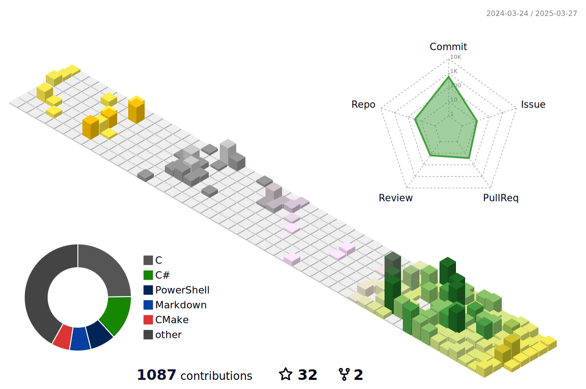

<!---
########################################
#                                      #
#             Dmytrii Dudko            #
#                                      #
#            Copyright 2025            #
#         All rights reserved          #
########################################
--->

  

  

<h1 align=center>Contribution Chart</h1>

 
<h3 align="center">I’m currently open to new projects in <b>automation, embedded systems, network infrastructure, AI, and system development. Let’s build something great together! 😊</b></h3>

 
<h2 >Views :heart:  
</h2> 

<!--,-->

<!--  -->

## Predominant languages

| Commits | Repositories |
| ------ | ------ |
|  |  |

Note: My Git-Hub has these predominant languages ​​but as a multiplatform Dev I can easily adapt to developing solid and scalable systems in any technology.

## Contribution status

| Contributions | Average productivity |
| --- | --- |
|  |  |

## Trophies

<h1 align="center">Portfolio</h1>

Here are some of the repositories I've highlighted on my profile. I suggest you check out all the other projects I've contributed to if you're looking for a simple proof of my work.

| Language | Projects |
| --- | --- |
|  | 

 |
|  | 

 |
|  | 

 |
|  | 

 |
|  | 

 |
|  | 

 | 

|  | 
 
 |
|  | 

 |
|  | 

 |

 NOTE: Many of EBS Systems' project files are private. If you would like to learn more about the internal workings, please contact us.

<!-- ## <h1 align=center>Projects I participate in</h1> ##

     

 -->

> Last update: 2025/March

